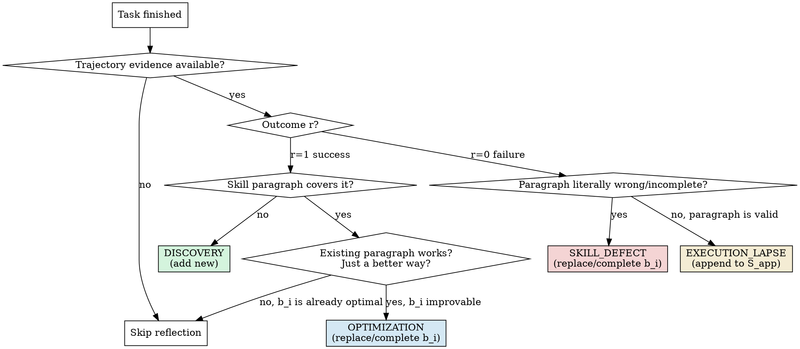

# Skill-Aware Reflection

## Overview

After a procedural task (one that applied a named skill, method, or multi-step procedure), do **not** rewrite the whole skill. Instead, classify what actually happened into one of four reflection types, target a specific `b_i` (skill paragraph), and choose a discrete directive. This is "skill-aware" because every reflection is anchored to the **current** skill text — never to the whole skill at once.

The four types come from EmbodiSkill (Ju et al., 2026). They partition the space cleanly:

- **Success + new capability absent from skill** → Discovery
- **Success + existing paragraph can be done better** → Optimization
- **Failure + paragraph wrong/incomplete/underspecified** → SkillDefect
- **Failure + paragraph valid but not followed** → ExecutionLapse

The skill structure follows EmbodiSkill's `S = (S_body, S_app)`: the body is rewritten only by the first three types; the appendix is updated only by ExecutionLapse.

## When to Use

Use when **all** of the following hold:

- A **procedural task** has just finished — one that required applying a named skill, method, or multi-step procedure (not a single-step lookup or single tool call). The defining test: did the agent follow a procedure with ≥2 ordered steps whose outcome depends on intermediate state?
- The task used at least one skill, sub-skill, or named procedure.
- The task outcome is evaluable: success, partial success, or failure.

Do NOT use when:

- The task was a single tool call, a single information lookup, or a single-step recall with no procedural skill involved.
- The user is asking for unrelated content (the skill should not interrupt).
- You have no trajectory evidence (no record of what was actually done).

## Quick Reference: Four-Type Decision



## The Reflection Record

Every reflection (except "skip") MUST produce one or more records of this shape. **One record, one type.**

| Field | Required | Meaning |
|---|---|---|
| `type` | yes | `DISCOVERY` / `OPTIMIZATION` / `SKILL_DEFECT` / `EXECUTION_LAPSE` |
| `evidence` | yes | Quoted trajectory excerpt: action taken, observation, or error message that triggered this reflection |
| `target_skill_content b_i` | yes for OPT/DEF/LAPSE; empty for DISCOVERY | Verbatim snippet of the existing paragraph being targeted; for DISCOVERY leave empty (the new content goes in `directive`) |
| `directive d_i` | yes | One of four discrete actions: `REPLACE b_i WITH <new>` / `COMPLETE b_i WITH <addendum>` / `APPEND <new paragraph>` (DISCOVERY) / `APPEND_TO_APPENDIX <reminder>` (EXECUTION_LAPSE) |
| `new_content` | when directive requires | The replacement / addendum / new paragraph / appendix reminder text |

## How to Read the Decision Table

Start at the top of the diagram and answer in order. **Do not skip steps.** Each branch is forced — there is no "general rewrite" option on this tree. If you find yourself wanting to rewrite the whole skill, you are doing it wrong; go back and re-classify.

### Success Path (r=1)

1. Did the trajectory reveal a capability the current skill does not cover? Look for actions the agent took that fall outside the skill's stated procedure. **If yes → DISCOVERY**. The new capability is recorded as a new paragraph (or as a "skill seed" if too speculative); `b_i` stays empty.
2. Otherwise: did the skill's existing paragraph work, but the trajectory suggests a more efficient / clearer / more robust way? **If yes → OPTIMIZATION**. Quote `b_i` (the existing paragraph) and specify `REPLACE` or `COMPLETE`.
3. Otherwise: skill was already optimal, the agent just followed it. **No reflection record needed.**

### Failure Path (r=0)

The critical fork is between SKILL_DEFECT and EXECUTION_LAPSE. Apply the **literal comparison method**:

1. Quote the relevant skill paragraph (`b_i`).
2. Quote the agent's actual action sequence from the trajectory.
3. Ask: does the skill paragraph say X, and the agent did not-X because the agent did not read or follow the skill? → EXECUTION_LAPSE
4. Or: does the skill paragraph say X, but X is wrong, missing, or underspecified, so even if the agent had followed it perfectly the task would have failed? → SKILL_DEFECT
5. If `b_i` is correct AND the agent followed it AND the task still failed → ESCALATE (the situation is outside the skill's scope; do not modify the skill).

## Skill Structure: S = (S_body, S_app)

The skill being reflected on has two parts. Treat them differently.

| Part | Modified by | Never modified by |
|---|---|---|
| `S_body` (main prescriptive content) | DISCOVERY (append), OPTIMIZATION (replace/complete), SKILL_DEFECT (replace/complete) | EXECUTION_LAPSE |
| `S_app` (execution reminders, "pay closer attention to…" highlights) | EXECUTION_LAPSE (append/merge) | DISCOVERY, OPTIMIZATION, SKILL_DEFECT |

This separation is the heart of the framework. Mixing them up is the most common failure mode: putting an ExecutionLapse into the body causes the paragraph to be reworded, which then looks like a SkillDefect next time, which causes more rewrites, until the skill is unrecognizable.

## Discipline (Anti-Patterns)

| Anti-pattern | Why it fails | What to do instead |
|---|---|---|
| Rewriting the whole skill on any signal | Loses the parts that already worked; embeds redundant content; rewords valid guidance | Always target a `b_i` with verbatim quote; pick a discrete directive |
| "The skill was vague so I'll just clarify everything" | The vague parts are the symptoms; the actual defect is in a specific paragraph | Find the specific paragraph; replace or complete only that one |
| Adding a speculative "what if we also support X" without trajectory evidence | Pollutes the skill; the new content was never validated | Wait until a task actually exercises X; then it becomes DISCOVERY |
| Putting "agent didn't read carefully" into SKILL_DEFECT | Confuses execution failure with skill failure; rewrites a valid skill | Use EXECUTION_LAPSE: append to appendix, do not touch body |
| Putting "skill was missing" into EXECUTION_LAPSE | Defect never gets fixed; task will fail again next time | Use SKILL_DEFECT: replace or complete the missing paragraph |
| One record that mixes Discovery and Optimization | Unclear what changed; partial state; hard to roll back | Split into multiple records, one per type |
| Forgetting to update `S_app` when ExecutionLapse repeats | Same lapse happens again; appendix stays empty | Each EXECUTION_LAPSE record APPEND_TO_APPENDIX with a clear reminder |

## Red Flags — Stop and Re-classify

You are about to violate the framework if you are doing any of these:

- [ ] Writing a reflection record without a `target_skill_content b_i` quote (except for DISCOVERY).
- [ ] Using a directive like "rewrite", "improve", "clarify", "tidy up".
- [ ] Modifying `S_body` after a failure without first checking if the agent followed the skill.
- [ ] Modifying `S_app` to add new rules (instead of just reminders).
- [ ] Adding content to the skill that no task has ever exercised.
- [ ] Combining multiple reflection types in a single record.
- [ ] Saying "skill is fine, no reflection needed" after a failure.

If any flag is checked, stop and re-run the decision tree.

## Anti-Rationalization Table

Common excuses to skip the framework, and why they are wrong:

| Excuse | Reality |
|---|---|
| "Skill is fine, just a one-off failure" | Failures cluster. The same defect will recur unless you classify it properly. |
| "The whole skill needs a refresh" | You are rationalizing a coarse rewrite. Find the specific paragraph. |
| "I don't have time to classify, let me just patch it" | A wrong classification (e.g., ExecutionLapse labeled as SkillDefect) makes the skill worse than not patching. |
| "Discovery is just a stretch goal" | Discovery requires trajectory evidence. Speculative additions are pollution, not discovery. |
| "Appendix is just clutter anyway" | Appendix exists for ExecutionLapse. It is the right place for "this paragraph is valid; please follow it." |
| "I'll fix it next time" | The framework's value is in the moment. Skipping it loses the structured signal. |
| "Multiple types overlap, hard to split" | Split anyway. Mixed records are un-actionable. |

## Common Mistakes

**Mistake 1: Discovery without evidence**
Adding "support for ER diagrams" to a Mermaid skill because it "could be useful". No task ever asked for ER diagrams. The added paragraph is speculative and untested.

*Fix*: A new capability only counts as DISCOVERY when the trajectory shows the agent using a procedure the skill never mentioned. Without that evidence, do not record a reflection.

**Mistake 2: SkillDefect when the skill is actually fine**
Task failed. The skill says "validate by calling API X". The agent called API X. API X returned a 500 error. The agent rewrites the skill to "validate by calling API Y".

*Fix*: The skill was correct. The failure was at the API / environment level. Classify as ESCALATE (outside skill scope) — do not modify the skill at all.

**Mistake 3: ExecutionLapse for a missing paragraph**
Task failed. The skill does not mention what to do when the API returns 500. The agent skipped handling 500, then re-runs the API.

*Fix*: The skill is missing a paragraph (a defect, not a lapse). Classify as SKILL_DEFECT with directive `APPEND` for the new "handle 500" paragraph.

**Mistake 4: Whole-skill rewrite disguised as Optimization**
A success where the agent spent 5x the expected time. The reflection record says `OPTIMIZATION` with directive "streamline the whole procedure".

*Fix*: Find the specific paragraph that caused the slowdown. Quote it as `b_i`. Replace or complete that one paragraph. Do not rewrite the procedure.

## Quick Algorithm

```
INPUT: trajectory τ, current skill S = (S_body, S_app), task outcome r
OUTPUT: zero or more reflection records, plus an updated S

1. IF no trajectory evidence available: return (no records, S unchanged)
2. IF r == 1 (success):
     a. Was a new capability exercised that S_body does not cover?
        → emit DISCOVERY record (b_i = "")
     b. Otherwise, does some b_i in S_body have a more efficient form?
        → emit OPTIMIZATION record (b_i = quote, directive = REPLACE or COMPLETE)
     c. Otherwise: no record
3. IF r == 0 (failure):
     a. Quote the relevant b_i and the actual action sequence
     b. Is b_i literally wrong / incomplete / underspecified (so following it
        perfectly would still fail)?
        → emit SKILL_DEFECT record (b_i = quote, directive = REPLACE or COMPLETE)
     c. Is b_i correct, but the agent's actions diverged from it?
        → emit EXECUTION_LAPSE record (b_i = quote, directive = APPEND_TO_APPENDIX)
     d. Is b_i correct AND the agent followed it AND it still failed?
        → no record (ESCALATE outside skill scope; do not modify S)
4. Apply records: update S_body from DISCOVERY/OPTIMIZATION/SKILL_DEFECT;
                  update S_app from EXECUTION_LAPSE (merge duplicates, drop
                  items no longer anchored in S_body).
5. Return updated S
```

## Output Format

When invoked, produce:

1. **Classification line**: `[REFLECTION: <type>]` or `[REFLECTION: NONE]`
2. **Evidence**: 1-3 quoted lines from the trajectory
3. **Target**: `b_i: "<verbatim quote from S_body>"` (or empty for DISCOVERY)
4. **Directive**: one of the four discrete forms
5. **Updated S** (only if a record was emitted)

## Self-Test (mental check before emitting)

Before emitting any record, ask yourself:

1. Did I quote `b_i` verbatim from the current skill? If not, stop.
2. Did I pick exactly one type? If not, split.
3. Is the evidence from the actual trajectory, not from a hypothetical? If not, stop.
4. For success path: would removing my record change the skill? If not, I should not have emitted.
5. For failure path: would a perfect agent following the skill verbatim have succeeded? If yes → SKILL_DEFECT. If no, but the skill is correct → EXECUTION_LAPSE.
